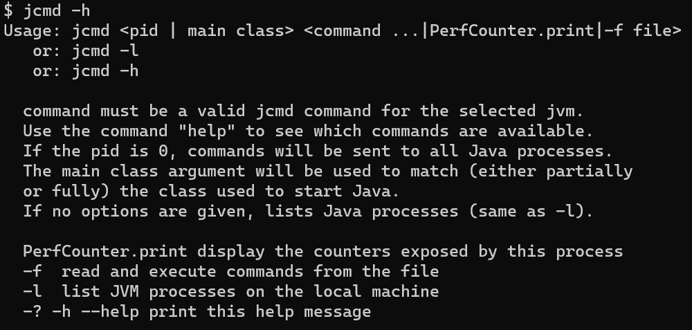
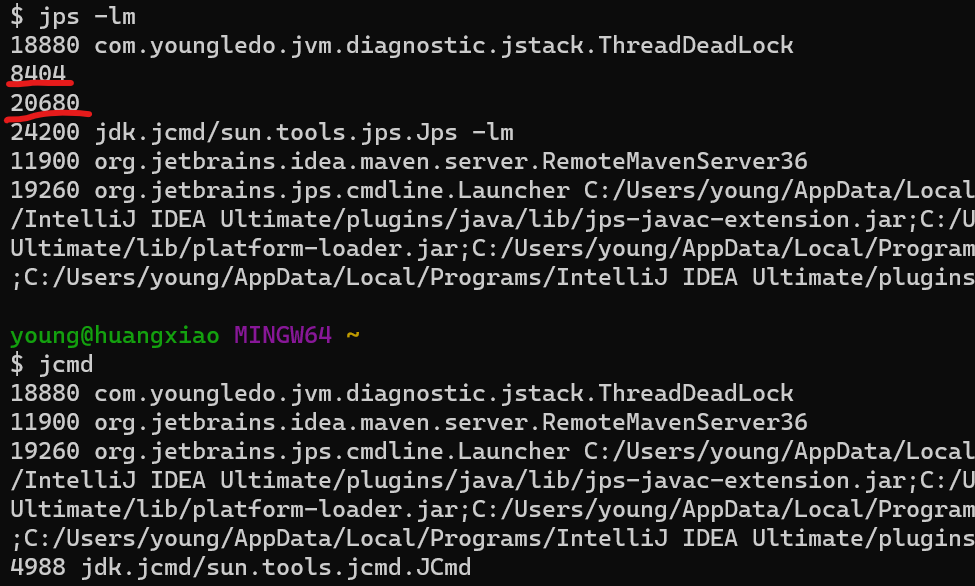
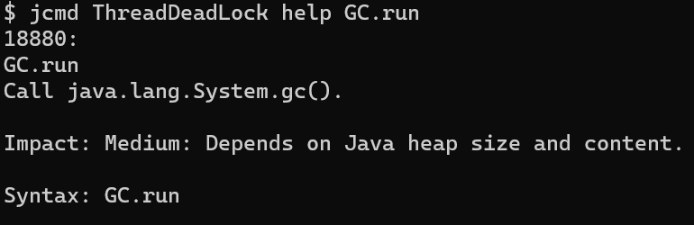
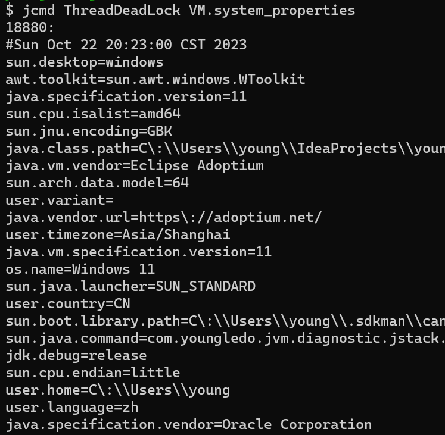
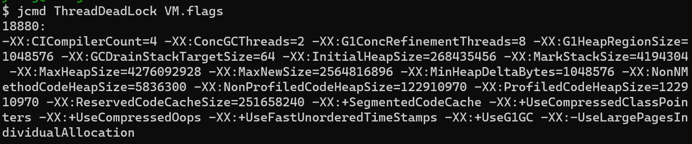
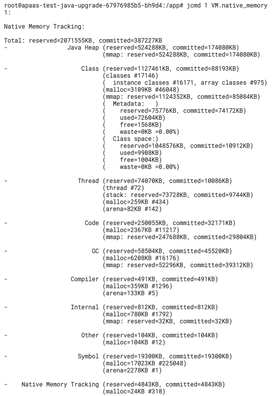
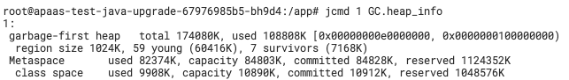

# jcmd
> [jcmd](https://docs.oracle.com/en/java/javase/11/troubleshoot/diagnostic-tools.html#GUID-42A18B29-B4AD-4831-B846-2CDBA55F2254)，在Java 8新增的一个命令行的工具。它是一个多功能的工具，可以用来实现前面除了`jstat`之外所有命令的功能，Java 8官网建议使用它来替代其它命令行工具。比如用它来导出堆、线程、内存使用、查看Java进程、GC、JVM运行时间等。 

## 使用说明


### 命令项
- jcmd：打印进程信息，等同于`jps -lm`但貌似某些进程显示不了（如图）。



- pid或者主类名：输出可用的命令
```bash
$ jcmd ThreadDeadLock
18880:
The following commands are available:
Compiler.CodeHeap_Analytics
Compiler.codecache
Compiler.codelist
Compiler.directives_add
```
或者
```bash
$ jcmd 18880
18880:
The following commands are available:
Compiler.CodeHeap_Analytics
Compiler.codecache
Compiler.codelist
Compiler.directives_add
```
- help命令：`jcmd <pid或者主类名> help 命令`输出命令的使用说明

    

##### 命令分类
- 线程
  1. jcmd <process id/main class> Thread.print：该命令等同于`jstack`。

- VM
  1. jcmd <process id/main class> VM.version：打印完整的HotSpot和JDK版本ID。
  2. jcmd <process id/main class> VM.system_properties：打印为虚拟机设置的所有系统属性。

     

  3. jcmd <process id/main class> VM.flags：打印标志信息，即使您没有提供任何标志，也会打印一些默认值，例如初始和最大堆大小。

     
  4. jcmd <process id/main class> VM.native_memory：打印虚拟机的本地内存使用情况，包含机会整个JVM的内存情况。
     > 注意需要设置`-XX:NativeMemoryTracking=[off | summary | detail]`选项才能使用该命令。
     > 
     > 详情参考官网：[Native Memory Tracking](https://docs.oracle.com/en/java/javase/11/vm/native-memory-tracking.html#GUID-710CAEA1-7C6D-4D80-AB0C-B0958E329407)
    
     

- GC
  1. GC.class_histogram：内部类和特定于应用程序的类都包含在列表中。占用最多内存的类列在顶部，并且类按降序列出。
     > 这与使用`jmap -histo[:live] <pid>`相同，可以使用`jcmd <process id/main class> help GC.class_histogram`输出详细说明。
  2. GC.heap_dump filename=Myheapdump.hprof：创建堆转储。
     > 这与使用`jmap -dump:file=<file> <pid>`，可以使用`jcmd <process id/main class> help GC.heap_dump`输出详细说明。
  3. GC.heap_info
     > 提供通用Java堆信息。
     > 影响: 中等
     > 
     
  4. GC.run
     > 调用`java.lang.System.gc()`。
     > 
     > 影响: 中等，取决于Java堆大小和内容。
  
- [JFR（JDK Flight Recorder）](java/tools/cli/jfr.md)
  1. JFR.start
      > 开始记录，例如，要对正在运行的标识符为 7060 的 Java 进程启动 2 分钟的录制并将其保存到当前目录中的 myrecording.jfr，请使用以下命令：
      > ```bash
      > jcmd 7060 JFR.start name=MyRecording settings=profile delay=20s duration=2m filename=C:\TEMP\myrecording.jfr
      > ```
  2. JFR.check
     > 检查正在运行的记录：
     > ```bash
     > jcmd 7060 JFR.check
     > ```
  3. JFR.stop
     > 停止正在运行的记录并可以选择丢弃记录数据：
     > ```bash
     > jcmd 7060 JFR.stop
     > ```
  4. JFR.dump
     > 停止正在运行的记录并可以选择将记录转储到文件：
     > ```bash
     > jcmd 7060 JFR.dump name=MyRecording filename=C:\TEMP\myrecording.jfr
     > ```