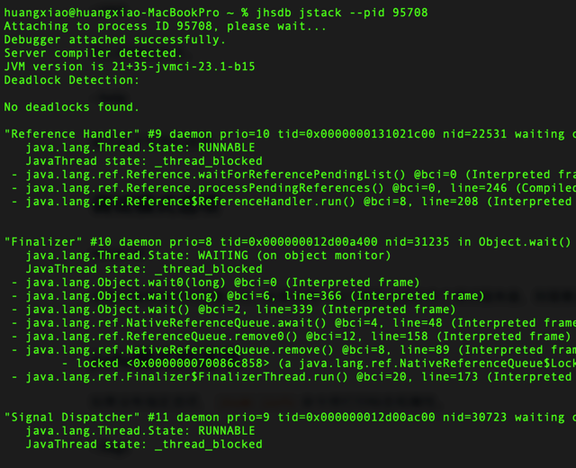
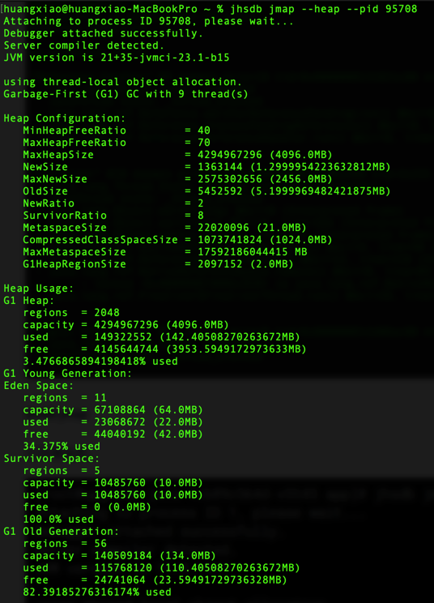
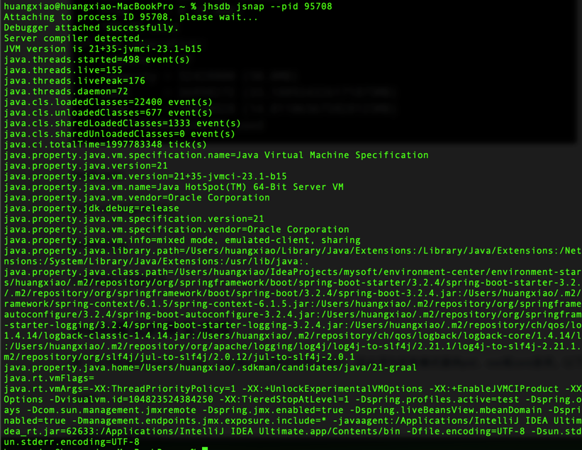

# jhsdb
> [Java HotSpot Serviceability Agent Debugger](https://docs.oracle.com/en/java/javase/11/tools/jhsdb.html#GUID-0345CAEB-71CE-4D71-97FE-AA53A4AB028E)可以从崩溃的Java虚拟机（JVM）附加到Java进程或核心转储。
> 
> `jhsdb`是一个Serviceability Agent（SA）工具。Serviceability Agent（SA）是一个JDK组件，用于提供快照调试、性能分析，并深入了解Hotspot JVM和Hotspot JVM执行的Java应用程序。
> 
> 尽管像 gdb 这样的原生调试器可以用于检查JVM，但与`jhsdb`不同，这些原生调试器对Hotspot中的数据结构没有内置的理解，因此无法对正在执行的Java应用程序进行深入了解。`jhsdb`知道JVM关键组件的位置和地址范围，如Java堆、堆代、区域、代码缓存等。

### 概要
```shell
jhsdb clhsdb [--pid pid | --exe executable --core coredump]
```

```shell
jhsdb debugd [options] (pid | executable coredump) [server-id]
```

```shell
jhsdb hsdb [--pid pid | --exe executable --core coredump]
```

```shell
jhsdb jstack [--pid pid | --exe executable --core coredump] [options]
```

```shell
jhsdb jmap [--pid pid | --exe executable --core coredump] [options]
```

```shell
jhsdb jinfo [--pid pid | --exe executable --core coredump] [options]
```

```shell
jhsdb jsnap [options] [--pid pid | --exe executable --core coredump]
```

##### pid
jhsdb工具应附加到的进程ID。该进程必须是Java进程。要获得在机器上运行的Java进程的列表，请使用ps命令，如果JVM进程没有在单独的docker实例中运行，则使用`jps`命令。
> 注意: JDK 10添加了对附加到在单独的docker进程中运行的Java进程时使用附加API的支持。但是，jps命令不会列出在单独的docker实例中运行的JVM进程。如果您尝试将Linux主机与docker容器中的虚拟机连接，则必须使用ps等工具来查找JVM的PID。

##### server-id
当多个调试服务器在同一远程主机上运行时使用的可选唯一ID。

##### executable
从中生成核心转储的Java可执行文件。

##### coredump
jhsdb工具应附加到的核心文件。

##### options
jhsdb模式的命令行选项。请参见jhsdb模式的通用选项、debugd模式的选项、jinfo模式的选项、jmap模式的选项、jmap模式的选项、jstack模式的选项和jsnap模式的选项。
> 注意：必须提供`pid`或`executable`和`coredump`文件对。

### 描述
您可以使用jhsdb工具附加到Java进程或启动事后调试程序来分析崩溃的Java虚拟机 (JVM) 中的核心转储的内容。此命令是实验性的，不受支持。
> **注意**：将`jhsdb`工具附加到实时进程将导致进程挂起，并且当调试器分离时进程可能会崩溃。

可以在以下任何一种模式下启动`jhsdb`工具：

##### jhsdb clhsdb
启动交互式命令行调试器。

##### jhsdb debugd
启动远程调试服务器。

##### jhsdb hsdb
启动交互式GUI调试器。

##### jhsdb jstack
打印堆栈和锁信息。



##### jhsdb jmap
打印堆信息。

##### jhsdb jinfo
打印 JVM 的基本信息。

##### jhsdb jsnap
打印性能计数器信息。

### jhsdb模式的常见选项
除了任何所需的jstack、jmap、jinfo或jsnap模式特定选项外，还必须为所有模式提供pid、exe或core选项。以下选项适用于所有模式。

##### --pid
挂起进程的进程ID。

##### --exe
可执行文件名。

##### --core
核心转储文件名。

##### --help
显示命令可用的选项。

### 调试模式选项
##### server-id
此调试服务器的可选唯一ID。如果在同一台计算机上运行多个调试服务器，则需要这样做。

### jinfo模式的选项

如果没有指定选项，`jhsdb jinfo`命令将打印标志和属性。

##### --flags
打印VM标志。

##### --sysprops
打印Java系统属性。

##### no option
打印VM标志和Java系统属性。

### jmap模式的选项

除了以下特定于模式的选项外，还必须提供jhsdb模式的通用选项中描述的`pid`、`exe`或`core`选项。

##### no option
打印与Solaris `pmap`相同的信息。

##### --heap
打印java堆摘要。



##### --binaryheap
以`hprof`二进制格式转储 java 堆。

##### --dumpfile
需要写入信息的文件的名称。

##### --histo
打印`java`对象堆的直方图。

##### --clstats
打印类加载器统计信息。

##### --finalizerinfo
打印等待完成的对象的信息。

### jstack模式的选项
除了以下特定于模式的选项外，还必须提供jhsdb模式的通用选项中描述的 pid 、 exe 或 core 选项。

##### --locks
打印`java.util.concurrent`锁信息。

##### --mixed
如果平台允许，尝试打印 java 和原生帧。

### jsnap模式的选项

除了以下特定于模式的选项外，还必须提供jhsdb模式的通用选项中描述的`pid`、`exe`或`core`选项。

##### --all
打印所有性能计数器，不加`--all`参数只显示一般信息，例如：

