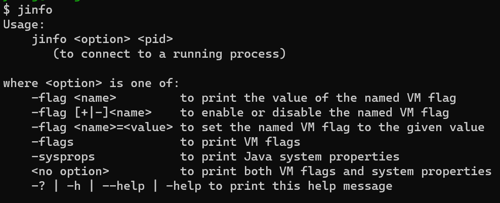
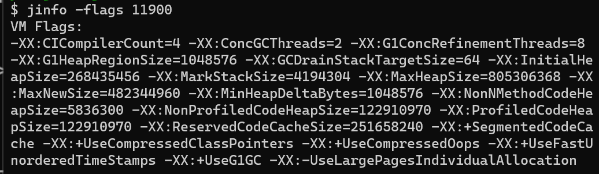
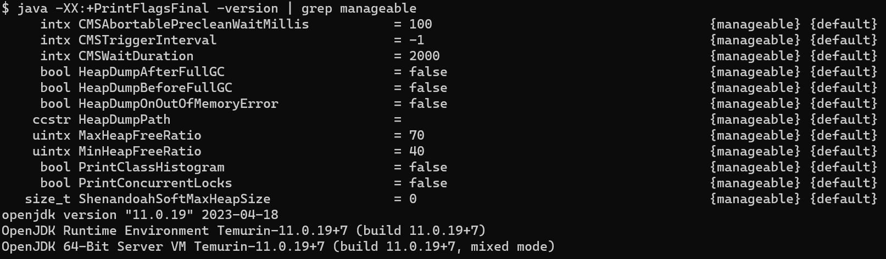
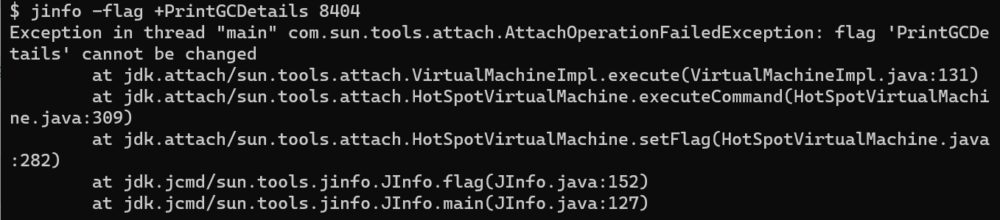

# jinfo

> [jinfo](https://docs.oracle.com/en/java/javase/11/tools/jinfo.html#GUID-69246B58-28C4-477D-B375-278F5F9830A5)：打印Java虚拟机配置信息，也可以用于调整参数。
>
> 在很多情况下，Java应用程序不会指定所有虚拟机参数（flag），而此时开发人员可能不知道某一个虚拟机参数的值（默认值和修改值），在这种情况下可能需要通过查找文档获取参数的值，但这个查找可能是非常艰难的。而有了`jinfo`工具，开发人员可以很方便地找到虚拟机参数的当前值。

## 使用说明



### 选项

- -flag `name`：打印指定命令行标志的名称和值。
  ```bash
  # 打印最大堆空间大小
  $ jinfo -flag MaxHeapSize 8404
  -XX:MaxHeapSize=167772160
  ```
  

- -flag `[+|-]name`：启用或禁用指定的布尔命令行标志（立即生效）。
  ```bash
  # 启用标志
  $ jinfo -flag +PrintGCDetails 8404
  -XX:-PrintGCDetails
  ```

- -flag `name=value`：设置指定的命令标志的值（立即生效）。
  ```bash
  # 设置标志的值
  $ jinfo -flag MaxHeapSize=1G 8404
  ```

- -flags：打印传递给JVM的命令行标志。

  
- -sysprops：以键值对的形式打印Java系统属性。

- **不加选项**：则打印`flags`和`sysprops`的选项参数，以及虚拟机参数（`VM Arguments`）。
> 不加选项时，额外会打印虚拟机参数
  ```bash
  $ jinfo 11900
  
  Java System Properties:
  #Sun Oct 22 16:10:27 CST 2023
  sun.desktop=windows
  awt.toolkit=sun.awt.windows.WToolkit
  java.specification.version=11
  sun.cpu.isalist=amd64
  sun.jnu.encoding=GBK
  
  VM Flags:
  -XX:CICompilerCount=4 -XX:ConcGCThreads=2
  
  VM Arguments:
  jvm_args: -Djava.awt.headless=true -Dmaven.defaultProjectBuilder.disableGlobalModelCache=true -Didea.version=2023.2.3
  ```

### 注意事项
需要注意的是，`jinfo`的修改能力是有限的，只有被标记为`manageable`的标志才可以：
```bash
# 打印虚拟机可以被管理的标志的最终值
java -XX:+PrintFlagsFinal -version | grep manageable
```


否则抛出异常：


