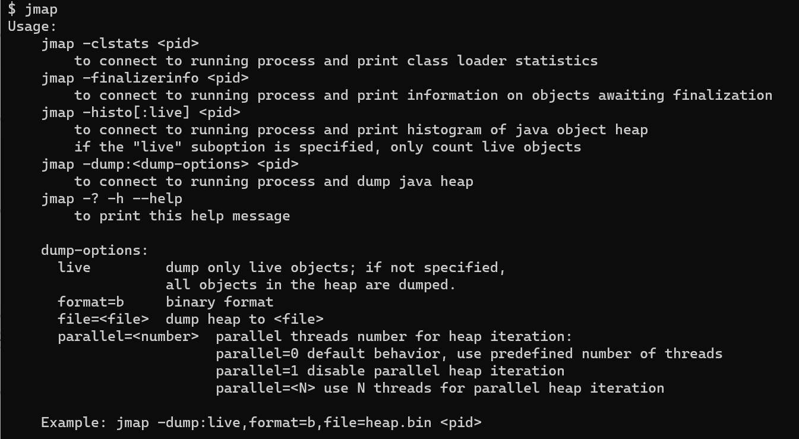

# jmap
> [JVM Memory Map](https://docs.oracle.com/en/java/javase/11/tools/jmap.html#GUID-D2340719-82BA-4077-B0F3-2803269B7F41)英文全称，作用于导出内存映像文件（堆转储快照二进制文件，即heap
> dump文件），它还可以获取目标Java进程的内存相关信息，包括Java堆各区域的使用情况、堆中对象的统计信息、类加载信息等。

## 使用说明

终端输入`jmap`即可查看帮助手册：



### 选项
- dump
    > 1. Heap dump即堆存储文件，指一个Java进程在某个时间点的内存快照。在触发导出时会保存的信息如下：
    >    - 所有对象：类、字段、基础类型值和引用对象
    >    - 所有类：类加载器、名称、父类、静态字段
    >    - 垃圾回收根：定义为JVM可访问的对象
    >    - 线程栈和本地变量：快照时线程的调用堆栈，以及关于本地对象的每帧信息
    > 2. hprof（Heap Profiler）是每个JDK版本附带的用于堆和CPU分析的工具。它是一个动态链接库，使用JVM工具接口(JVM TI)与JVM进行交互。该工具以ASCII或二进制格式将分析信息写入文件或套接字，该信息可以通过分析器前端工具进一步处理。
    > 
    > 说明：
    > 1. 如果使用了“live”参数会触发一次`full GC`，所以dump文件里保存的都是Full GC后留下的对象信息。
    > 2. 生成的dump文件比较耗时，尤其是大内存镜像生成的dump文件则需要耗费更长的时间来完成。

1. 手动导出（jmap命令），包含以下可选项：
   - **live** --- 指定时，仅转储活动对象；如果未指定，则转储堆中的所有对象（即无论是活动的对象还是已经被垃圾收集器标记为可回收但尚未回收的对象）。
   - format=b --- 以hprof二进制格式转储Java堆。在早期的Java版本中，还有其他格式如：
     - format=text：文本格式，人类可读性较强，但文件体积大且不便于高效分析。
     - format=hprof：一种更复杂的二进制格式，兼容HPROF协议，也被许多内存分析工具支持。
   - file=filename.bin或filename.hprof --- 将堆转储到文件

    ```bash
    # 导出指定进程下的存活的hprof二进制文件（生成文件之前会执行一次Full GC）
    jmap -dump:live,format=b,file=<filename.hprof> <pid>
    ```

2. 自动导出（JVM参数）
> 当程序发生OOM退出系统时，一些瞬时信息都随着程序的终止而消失，而重现OOM问题往往比较困难，此时若能在OOM时自动导出dump文件就显得非常迫切。在JVM参数上增加：
>
> 1. `-XX:+HeapDumpOnOutOfMemoryError`：在程序发生`OOM`时，JVM自动导出当前应用堆快照。
> 2. `-XX:+HeapDumpPath=<filename.hprof>`：指定堆快照的保存位置。

    ```bash
    java -XX:+HeapDumpOnOutOfMemoryError -XX:+HeapDumpPath=oom.hprof -jar app.jar
    ```

- histo
> 连接到正在运行的进程并打印Java对象堆的直方图。如果指定了活动子选项，则只计算活动对象。

    ```bash
    jmap -histo[:live] <pid>
    ```
    输出如下结果：
    
    ```plaintext
     num     #instances         #bytes  class name (module)
    -------------------------------------------------------
       1:        183558       26371368  [B (java.base@17.0.6)
       2:          5976        5645040  [I (java.base@17.0.6)
       3:        179625        4311000  java.lang.String (java.base@17.0.6)
       4:         36311        2512552  [Ljava.lang.Object; (java.base@17.0.6)
       5:         87308        2095392  kotlin.coroutines.CombinedContext
       6:         13036        1569696  java.lang.Class (java.base@17.0.6)
       7:         34080        1363200  java.util.LinkedHashMap$Entry (java.base@17.0.6)
    ```

- finalizerinfo
> 连接到正在运行的进程，并打印有关等待完成的对象的信息。

- clstats
> 连接到正在运行的进程并打印Java堆的类加载器统计信息。
