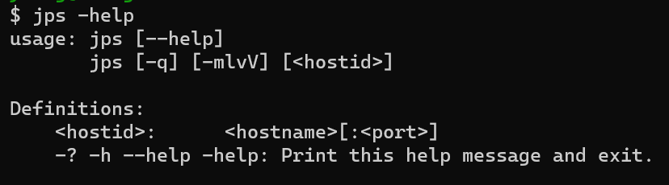
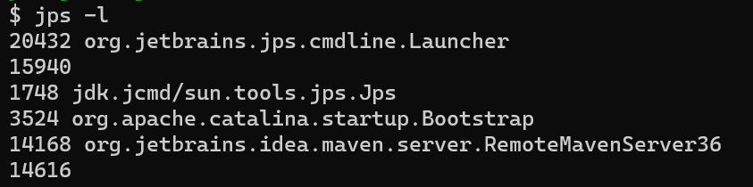
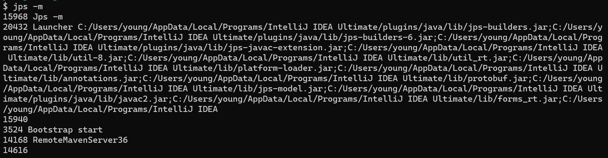
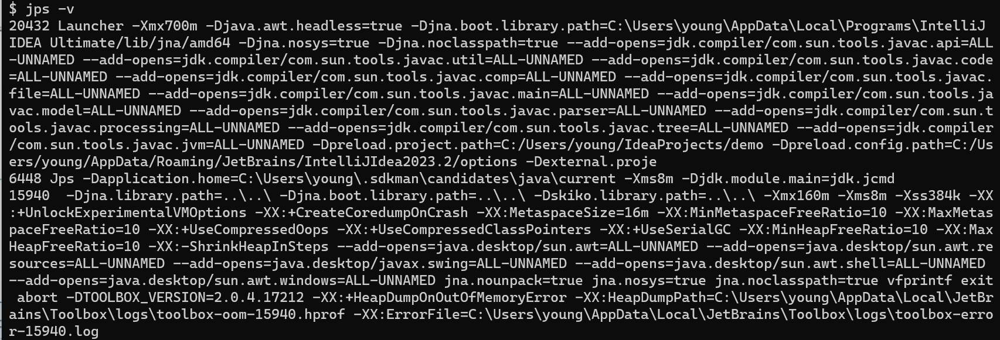

# jps
> [https://docs.oracle.com/en/java/javase/11/tools/jps.html#GUID-6EB65B96-F9DD-4356-B825-6146E9EEC81E)，用于显示系统内所有HotSpot虚拟机进程信息。
>
> 说明：对于本地虚拟机进程来说，本地虚拟机ID与操作系统的进程ID是一致的，是唯一的。
## 使用说明


### 选项
- -q（quiet）：仅仅显示LVMID（local virtual machine id），即本地虚拟机ID，不显示主类的名称。注意，该选项与以下存在互斥。
- mlvV：以下选项可以任意组合
  - -l（long）：显示应用程序主类的完整包名称或应用程序`jar`包的完整路径名。
      
  - -m（main）：显示传递给 main 方法的参数。对于`嵌入式JVM`，输出可能为空。
      
  - -v：显示传递给JVM的参数。，比如`-Xms1024m -Xmx1024m`。
      
  - V：抑制类名、JAR 文件名和传递给 main 方法的参数的输出，仅生成本地JVM标识符的列表。
- hostid：jps也支持远程连接`[protocol:][[//]hostname][:port][/servername]`：
    ```bash
    jps -m 192.168.1.10:8080
    ```

**注意：如果某java进程关闭了默认开启的`UsePerfData`参数（即使用参数`-XX:-UsePerfData`），那么`jps`命令（以及后面的`jstat`）将无法探知该Java进程。**