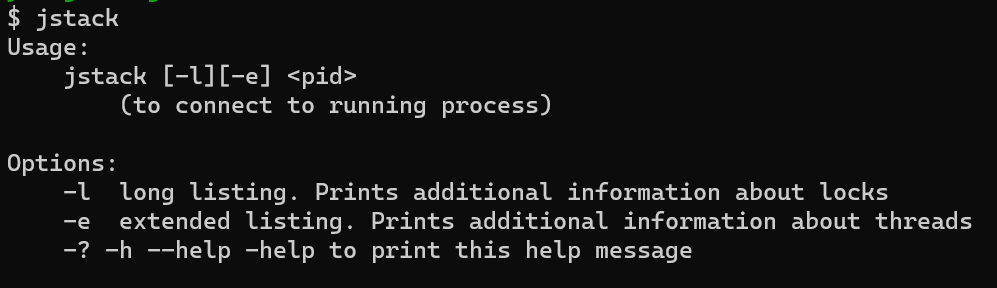

# jstack
> [JVM Stack Trace](https://docs.oracle.com/en/java/javase/11/tools/jstack.html#GUID-721096FC-237B-473C-A461-DBBBB79E4F6A)，用于打印指定Java进程的堆栈跟踪。可用于定位线程长时间停顿的原因，如线程间死锁、死循环、请求外部资源导致的长时间等待等问题。
>
> 堆栈跟踪就是当前虚拟机进程的每一条线程执行的方法堆栈的集合，在线程堆栈中，需要留意下面几种状态：
> - **Deadlock**，死锁
> - **Waiting on condition**，等待资源条件
> - **Waiting on monitor entry**，等待获取监视器
> - **BLOCKED**，阻塞
> - RUNNABLE，执行中
> - SUSPENDED，暂停
> - TIMED_WAITING，超时等待
> - PARKED，停止

### 使用说明

终端输入`jstack`即可查看帮助手册：



```bash
$ jstack 18880
2023-10-22 19:15:53
Full thread dump OpenJDK 64-Bit Server VM (11.0.19+7 mixed mode):

Threads class SMR info:
_java_thread_list=0x000001c4f0621040, length=13, elements={
0x000001c4f0193800, 0x000001c4f01bd800, 0x000001c4f0227800, 0x000001c4f0229000,
0x000001c4f022a000, 0x000001c4f022d000, 0x000001c4f0235800, 0x000001c4f023f000,
0x000001c4ef36b000, 0x000001c4f062f000, 0x000001c4f061a000, 0x000001c4f061c000,
0x000001c4cbb2a800
}

"Reference Handler" #2 daemon prio=10 os_prio=2 cpu=0.00ms elapsed=139.46s tid=0x000001c4f0193800 nid=0x5b78 waiting on condition  [0x00000069847ff000]
   java.lang.Thread.State: RUNNABLE
        at java.lang.ref.Reference.waitForReferencePendingList(java.base@11.0.19/Native Method)        at java.lang.ref.Reference.processPendingReferences(java.base@11.0.19/Reference.java:241)
        at java.lang.ref.Reference$ReferenceHandler.run(java.base@11.0.19/Reference.java:213)

"Thread-0" #14 prio=5 os_prio=0 cpu=0.00ms elapsed=139.34s tid=0x000001c4f061a000 nid=0x47c8 waiting for monitor entry  [0x00000069853ff000]
   java.lang.Thread.State: BLOCKED (on object monitor)
        at com.youngledo.jvm.diagnostic.jstack.ThreadDeadLock$1.run(ThreadDeadLock.java:35)
        - waiting to lock <0x0000000710f94078> (a java.lang.StringBuilder)
        - locked <0x0000000710f94040> (a java.lang.StringBuilder)

"Thread-1" #15 prio=5 os_prio=0 cpu=0.00ms elapsed=139.34s tid=0x000001c4f061c000 nid=0x2790 waiting for monitor entry  [0x00000069854ff000]
   java.lang.Thread.State: BLOCKED (on object monitor)
        at com.youngledo.jvm.diagnostic.jstack.ThreadDeadLock$2.run(ThreadDeadLock.java:63)
        - waiting to lock <0x0000000710f94040> (a java.lang.StringBuilder)
        - locked <0x0000000710f94078> (a java.lang.StringBuilder)
        at java.lang.Thread.run(java.base@11.0.19/Thread.java:829)

"G1 Young RemSet Sampling" os_prio=2 cpu=0.00ms elapsed=139.47s tid=0x000001c4ef29b800 nid=0x4e30 runnable
"VM Periodic Task Thread" os_prio=2 cpu=0.00ms elapsed=139.34s tid=0x000001c4f0630000 nid=0xe54 waiting on condition

JNI global refs: 16, weak refs: 0


Found one Java-level deadlock:
=============================
"Thread-0":
  waiting to lock monitor 0x000001c4f01bd000 (object 0x0000000710f94078, a java.lang.StringBuilder),
  which is held by "Thread-1"
"Thread-1":
  waiting to lock monitor 0x000001c4f01bd100 (object 0x0000000710f94040, a java.lang.StringBuilder),
  which is held by "Thread-0"

Java stack information for the threads listed above:
===================================================
"Thread-0":
        at com.youngledo.jvm.diagnostic.jstack.ThreadDeadLock$1.run(ThreadDeadLock.java:35)
        - waiting to lock <0x0000000710f94078> (a java.lang.StringBuilder)
        - locked <0x0000000710f94040> (a java.lang.StringBuilder)
"Thread-1":
        at com.youngledo.jvm.diagnostic.jstack.ThreadDeadLock$2.run(ThreadDeadLock.java:63)
        - waiting to lock <0x0000000710f94040> (a java.lang.StringBuilder)
        - locked <0x0000000710f94078> (a java.lang.StringBuilder)
        at java.lang.Thread.run(java.base@11.0.19/Thread.java:829)

Found 1 deadlock.
```

### 选项
- -l：打印有关锁的附加信息。
> 与不加选项的主要区别在于多了`Locked ownable synchronizers`。

- e：打印扩展信息。

## 参考
[记录一次死锁（二）与Locked ownable synchronizers](https://blog.csdn.net/tanhongwei1994/article/details/100144748)