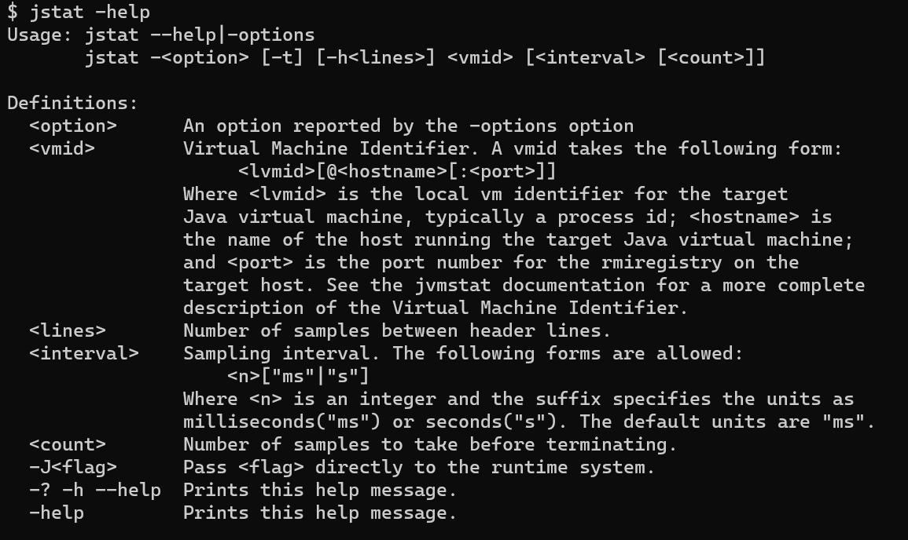

# jstat
> [JVM Statistics Monitor Tool](https://docs.oracle.com/en/java/javase/11/tools/jstat.html#GUID-5F72A7F9-5D5A-4486-8201-E1D1BA8ACCB5)：用于监视虚拟机各种运行状态的命令行工具。
> 
> 它可以显示本地或者远程虚拟机进程中的类装载、内存、垃圾回收、JIT编译器（即时编译器）等运行数据。 在没有图形化界面时，它将是运行期定位虚拟机性能问题的首选工具。

## 使用说明


### 选项说明
#### 1. class选项：显示有关类加载器行为的统计信息。
- Loaded: 加载的类数。
- Bytes: 已加载类的KB数。
- Unloaded: 已卸载的类数。
- Bytes: 已卸载的KB数。
- Time: 执行类加载和卸载操作所花费的时间。

```bash
# 1. 输出简单的类加载信息：jstat -class <vmid>
$ jstat -class 6272
Loaded  Bytes  Unloaded  Bytes     Time
   989  2281.3        0     0.0       0.16
   
# 2. 每隔1000毫秒输出一次：jstat -class <vmid> [<interval>]
$ jstat -class 6272 1000
Loaded  Bytes  Unloaded  Bytes     Time   
   989  2281.3        0     0.0       0.16
   989  2281.3        0     0.0       0.16
   989  2281.3        0     0.0       0.16
   989  2281.3        0     0.0       0.16
   
# 3. 每隔300毫秒并输出2次：jstat -class <vmid> [<interval> [<count]]
$ jstat -class 6272 300 2
Loaded  Bytes  Unloaded  Bytes     Time   
   989  2281.3        0     0.0       0.16
   989  2281.3        0     0.0       0.16

# 4. 输出类加载器的运行时长：jstat -class [-t] <vmid>
$ jstat -class -t 6272
Timestamp Loaded  Bytes  Unloaded  Bytes     Time   
   1449.3    989  2281.3        0     0.0    0.16

# 5. 输出指定行数的表头信息：jstat -class [-t] [-h<lines>] <vmid> [<interval> [<count]]
$ jstat -class -t -h2 6272 1000 5
Timestamp       Loaded  Bytes  Unloaded  Bytes     Time   
         1869.3    989  2281.3        0     0.0       0.16
         1870.4    989  2281.3        0     0.0       0.16
Timestamp       Loaded  Bytes  Unloaded  Bytes     Time   
         1871.4    989  2281.3        0     0.0       0.16
         1872.4    989  2281.3        0     0.0       0.16
Timestamp       Loaded  Bytes  Unloaded  Bytes     Time   
         1873.4    989  2281.3        0     0.0       0.16
```

#### 2. compiler选项：显示有关 Java HotSpot VM 即时编译器行为的统计信息。
##### -compiler：输出即时编译器编译过的方法、耗时等统计信息。
- Compiled: 已执行的编译任务数。
- Failed: 失败的编译任务数。
- Invalid: 无效的编译任务数。
- Time: 执行编译任务所花费的时间。
- FailedType: 最后一次编译失败的编译类型。
- FailedMethod: 最后一次编译失败的类名和方法。
```bash
# jstat -compiler <vmid>
$ jstat -compiler 6272
Compiled Failed Invalid   Time   FailedType FailedMethod
     248      0       0     0.13          0             
```

##### -printcompilation：显示Java HotSpot VM编译方法统计信息。
- Compiled: 最近编译的方法所执行的编译任务数。
- Size: 最近编译的方法的字节代码数。
- Type: 最近编译的方法的编译类型。
- Method: 类名和方法名，用于标识最近编译的方法。类名使用斜线（/）而不是点（.）作为名称空间分隔符。方法名称是指定类中的方法。这两个字段的格式与HotSpot`-XX:+PrintCompilation`选项一致。
```bash
# jstat -printcompilation <vmid>
$ jstat -printcompilation 6272
Compiled  Size  Type Method
     248     26    1 java/lang/String length
```

#### 3. gc选项：显示有关垃圾收集堆行为的统计信息
##### -gc：垃圾回收堆统计信息。
- S0C: 当前survivor（幸存者）0空间的容量（KB）。
- S1C: 当前survivor（幸存者）1空间的容量（KB）。
- S0U: survivor（幸存者）0空间使用（KB）。
- S1U: survivor（幸存者）1空间使用（KB）。
- EC: 当前eden（伊甸园）空间容量 （KB）。
- EU: eden（伊甸园）空间使用（KB）。
- OC: 当前old（老年代）空间的容量（KB）。
- OU: old（老年代）空间使用（KB）。
- MC: Metaspace（元空间）提交的大小（KB）。
- MU: Metaspace（元空间）使用的大小（KB）。
- CCSC: Compressed class（压缩类）提交的大小（KB）。
- CCSU: Compressed class（压缩类）空间使用的大小（KB）。
- YGC: 年轻代垃圾回收事件的数量。
- YGCT: 年轻代垃圾回收时间。
- FGC: 完整回收事件的数量。
- FGCT: 完整回收的时间。
- CGC: 并发垃圾回收事件的数量。
- CGCT: 并发垃圾回收时间。
- GCT: 垃圾回收总时间（YFCT + FGCT之和）。

```bash
# 每300毫秒并以每5行为一页，总共输出50次：jstat -gc [-h<lines> <vmid> [<interval> [<count]]
$ jstat -gc -h5 22388 300 50
 S0C    S1C    S0U    S1U      EC       EU        OC         OU       MC     MU    CCSC   CCSU   YGC     YGCT    FGC    FGCT    CGC    CGCT     GCT   
 0.0   1024.0  0.0   1024.0  3072.0    0.0     57344.0    54872.5   7680.0 7367.3 768.0  638.0      10    0.021   0      0.000   8      0.005    0.026
 0.0   1024.0  0.0   1024.0  3072.0    0.0     57344.0    54872.5   7680.0 7367.3 768.0  638.0      10    0.021   0      0.000   8      0.005    0.026
 0.0   1024.0  0.0   1024.0  3072.0   1024.0   57344.0    55796.5   7680.0 7367.3 768.0  638.0      11    0.022   0      0.000  10      0.006    0.028
 0.0   1024.0  0.0   1024.0  3072.0   1024.0   57344.0    55796.5   7680.0 7367.3 768.0  638.0      11    0.022   0      0.000  10      0.006    0.028
 0.0   1024.0  0.0   1024.0  3072.0   1024.0   57344.0    55796.5   7680.0 7367.3 768.0  638.0      11    0.022   0      0.000  10      0.006    0.028
 S0C    S1C    S0U    S1U      EC       EU        OC         OU       MC     MU    CCSC   CCSU   YGC     YGCT    FGC    FGCT    CGC    CGCT     GCT   
 0.0   1024.0  0.0   1024.0  3072.0   1024.0   57344.0    55796.5   7680.0 7367.3 768.0  638.0      11    0.022   0      0.000  10      0.006    0.028
 0.0   1024.0  0.0   1024.0  3072.0   1024.0   57344.0    55796.5   7680.0 7367.3 768.0  638.0      11    0.022   0      0.000  10      0.006    0.028
 0.0    0.0    0.0    0.0    3072.0    0.0     58368.0    58157.2   7680.0 7367.3 768.0  638.0      12    0.023   1      0.008  10      0.006    0.037
 0.0    0.0    0.0    0.0    3072.0    0.0     58368.0    58157.2   7680.0 7367.3 768.0  638.0      12    0.023   1      0.008  10      0.006    0.037
 0.0    0.0    0.0    0.0   20480.0    0.0     40960.0     1343.6   7680.0 7367.5 768.0  638.0      14    0.025   4      0.019  10      0.006    0.050
 S0C    S1C    S0U    S1U      EC       EU        OC         OU       MC     MU    CCSC   CCSU   YGC     YGCT    FGC    FGCT    CGC    CGCT     GCT   
 0.0    0.0    0.0    0.0   20480.0    0.0     40960.0     1343.6   7680.0 7367.5 768.0  638.0      14    0.025   4      0.019  10      0.006    0.050
```
> 注
> 1. 通过以上数据的观察，如果`OU`（老年代使用的空间）越来越大，则说明无法被GC的越来越多，最终由`OOM`的风险。
> 2. 另外，也可以比较程序的`Timestamp`（启动时间戳）与`GCT`的占比情况。当占比超过20%则说明堆的压力比较大；当比例超过90%则说明堆里几乎没有可用空间，随时都可能`OOM`。

##### -gccapacity：内存池生成和空间容量。
- NGCMN: Minimum new generation capacity (KB).
- NGCMX: Maximum new generation capacity (KB).
- NGC: Current new generation capacity (KB).
- S0C: Current survivor space 0 capacity (KB).
- S1C: Current survivor space 1 capacity (KB).
- EC: Current eden space capacity (KB).
- OGCMN: Minimum old generation capacity (KB).
- OGCMX: Maximum old generation capacity (KB).
- OGC: Current old generation capacity (KB).
- OC: Current old space capacity (KB).
- MCMN: Minimum metaspace capacity (KB).
- MCMX: Maximum metaspace capacity (KB).
- MC: Metaspace Committed Size (KB).
- CCSMN: Compressed class space minimum capacity (KB).
- CCSMX: Compressed class space maximum capacity (KB).
- CCSC: Compressed class committed size (KB).
- YGC: Number of young generation GC events.
- FGC: Number of full GC events.

##### -gccause：此选项显示与`-gcutil`功能一样，但包括上次垃圾回收事件和当前垃圾回收事件的原因。除了为`-gcutil`列出的列之外，此选项还添加以下列：
- LGCC：上次垃圾回收的原因。
- GCC: 当前垃圾回收的原因。
```bash
$ jstat -gccause -h5 24668 300 100
  S0     S1     E      O      M     CCS    YGC     YGCT    FGC    FGCT    CGC    CGCT     GCT    LGCC                 GCC                 
  0.00 100.00  33.33  97.30  95.91  83.08     11    0.023     0    0.000    10    0.005    0.028 G1 Evacuation Pause  No GC
  0.00 100.00  33.33  97.30  95.91  83.08     11    0.023     0    0.000    10    0.005    0.028 G1 Evacuation Pause  No GC               
  0.00 100.00  33.33  97.30  95.91  83.08     11    0.023     0    0.000    10    0.005    0.028 G1 Evacuation Pause  No GC               
  0.00   0.00   0.00  99.81  95.91  83.08     12    0.024     1    0.006    10    0.005    0.036 G1 Evacuation Pause  No GC               
  0.00   0.00   0.00   3.20  95.91  83.08     14    0.025     4    0.015    10    0.005    0.045 G1 Evacuation Pause  No GC               
  S0     S1     E      O      M     CCS    YGC     YGCT    FGC    FGCT    CGC    CGCT     GCT    LGCC                 GCC                 
  0.00   0.00   0.00   3.20  95.91  83.08     14    0.025     4    0.015    10    0.005    0.045 G1 Evacuation Pause  No GC
  0.00   0.00   0.00   3.20  95.91  83.08     14    0.025     4    0.015    10    0.005    0.045 G1 Evacuation Pause  No GC 
```

##### -gcnew：新生代统计数据。
- S0C: 当前survivor（幸存者）0的空间大小（KB）。
- S1C: 当前survivor（幸存者）1的空间大小（KB）。
- S0U: survivor（幸存者）0空间使用（KB）。
- S1U: survivor（幸存者）1空间使用（KB）。
- TT: 晋升（tenuring）阈值。
- MTT: 最大晋升（tenuring）阈值。
- DSS: 期望survivor空间大小（KB）。
- EC: 当前eden（伊甸园）空间容量 （KB）。
- EU: eden（伊甸园）空间使用（KB）。
- YGC: 年轻代垃圾回收事件的数量。
- YGCT: 年轻代垃圾回收时间。
> `tenuring threshold`决定何时可以将对象从年轻代提升/移动到老年代。我们可以使用`-XX:InitialTenuringThreshold`和`-XX:MaxTenuringThreshold`标志设置保有阈值的初始值和最大值。我们还可以使用`-XX:TargetSurvivorRatio`来指定年轻代GC结束时Survivor Space的目标利用率（百分比）。

##### -gcnewcapacity：新生代空间容量统计。
- NGCMN: 最小新生代容量（KB）。
- NGCMX: 最大新生代容量（KB）。
- NGC: 当前新生代容量（KB）。
- S0CMX: 最大幸存者空间0容量（KB）。
- S0C: 当前幸存者空间0容量（KB）。
- S1CMX: 幸存者空间1的最大容量（KB）。
- S1C: 当前幸存者空间1容量（KB）。
- ECMX: 最大eden空间容量（KB）。
- EC: 当前eden（伊甸园）空间容量 （KB）。
- YGC: 年轻代垃圾回收事件的数量。
- FGC: 完整GC事件的数量。

##### -gcold：老年代统计数据。
- MC: 元空间提交大小（KB）。
- MU: 元空间利用率（KB）。
- CCSC: 压缩类提交大小（KB）。
- CCSU: 已使用压缩类空间（KB）。
- OC: 当前老年代空间容量（KB）。
- OU: 老年代空间利用率（KB）。
- YGC: 年轻代GC事件的数量。
- FGC: 完整GC事件的数量。
- FGCT: 完整的垃圾收集时间。
- GCT: 总垃圾收集时间。

##### -gcoldcapacity：老年代容量统计。
- OGCMN: 最小老年代容量 (KB)。
- OGCMX: 最大老年代容量 (KB)。
- OGC: 当前老年代容量（总的OC）(KB)。
- OC: 当前老年代容量 (KB)。
- YGC: 年轻代GC手机事件的数量。
- FGC: 完整GC事件的数量。
- FGCT: 完整的垃圾收集时间。
- GCT: 总垃圾收集时间。
> 关于`OGC`和`OC`的区别：https://stackoverflow.com/questions/11253285/jstat-difference-between-ogc-oc-pgc-pc

##### -gcmetacapacity：元空间容量统计。
- MCMN: 最小元空间容量 (KB)。
- MCMX: 最大元空间容量 (KB)。
- MC: 元空间提交大小（KB）。
- CCSMN: 压缩类空间最小容量（KB）。
- CCSMX: 压缩类空间最大容量（KB）。
- YGC: 年轻代GC事件的数量。
- FGC: 完整GC事件的数量。
- FGCT: 完整的垃圾收集时间。
- GCT: 总垃圾收集时间。

##### -gcutil：垃圾回收统计信息摘要（百分比）。
- S0: 幸存者空间0利用率占空间当前容量的百分比。
- S1: 幸存者空间1利用率占空间当前容量的百分比。
- E: Eden空间利用率占空间当前容量的百分比。
- O: 老年代空间利用率占空间当前容量的百分比。
- M: 元空间利用率占空间当前容量的百分比。
- CCS: 以百分比表示的压缩类空间利用率。
- YGC: 年轻代GC事件的数量。
- YGCT: 年轻代的垃圾收集时间。
- FGC: 完整GC事件的数量。
- FGCT: 完整的垃圾收集时间。
- GCT: 垃圾收集总时间。
```bash
# 每300毫秒并以每5行为一页，总共输出50次：jstat -gcutil [-h<lines> <vmid> [<interval> [<count]]
$ jstat -gcutil -h5 4388 300 50
  S0     S1     E      O      M     CCS    YGC     YGCT    FGC    FGCT    CGC    CGCT     GCT   
  0.00 100.00   0.00  96.04  95.91  83.08     10    0.022     0    0.000     8    0.004    0.026
  0.00 100.00  33.33  98.00  95.91  83.08     11    0.023     0    0.000    10    0.006    0.028
  0.00 100.00  33.33  98.00  95.91  83.08     11    0.023     0    0.000    10    0.006    0.028
  0.00 100.00  66.67  98.00  95.91  83.08     12    0.023     0    0.000    10    0.006    0.028
  0.00   0.00   0.00  99.81  95.91  83.08     12    0.023     1    0.008    10    0.006    0.037
  S0     S1     E      O      M     CCS    YGC     YGCT    FGC    FGCT    CGC    CGCT     GCT   
  0.00   0.00   0.00   3.28  95.91  83.08     14    0.025     4    0.020    10    0.006    0.050
  0.00   0.00   0.00   3.28  95.91  83.08     14    0.025     4    0.020    10    0.006    0.050
```

### 关联说明
> [VisualGC](https://www.oracle.com/java/technologies/visual-garbage-collection-monitoring-tool.html)与jstat工具相关，提供垃圾回收、编译器和类加载器的图形化界面。
>
> VisualGC 工具不包含在JDK版本中，但可以从[jvmstat](https://www.oracle.com/java/technologies/jvmstat.html)技术页面单独下载。

