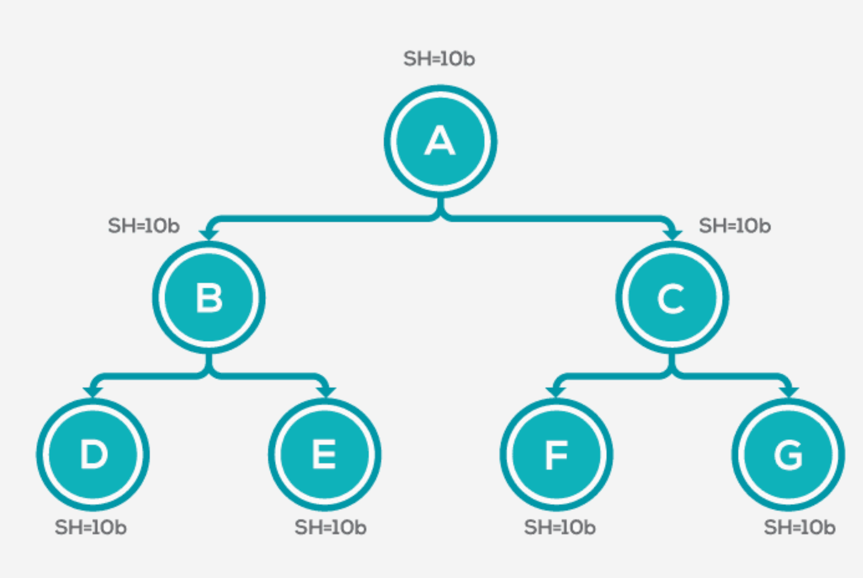

### Shallow Heap、Retained Heap以及Deep Heap

#### Shallow heap
  对象的`Shallow Heap`是其自身在内存中的大小。

#### Retained Heap

#### Deep Heap

## 附录
1. [Eclipse MAT：浅堆与保留堆](https://dzone.com/articles/eclipse-mat-shallow-heap-retained-heap)
2. [堆内存泄漏分析的一个例子](https://blog.csdn.net/yilongchuan/article/details/109532350)