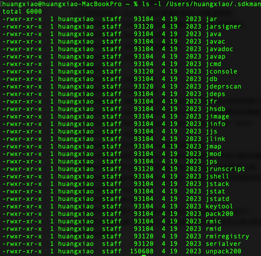
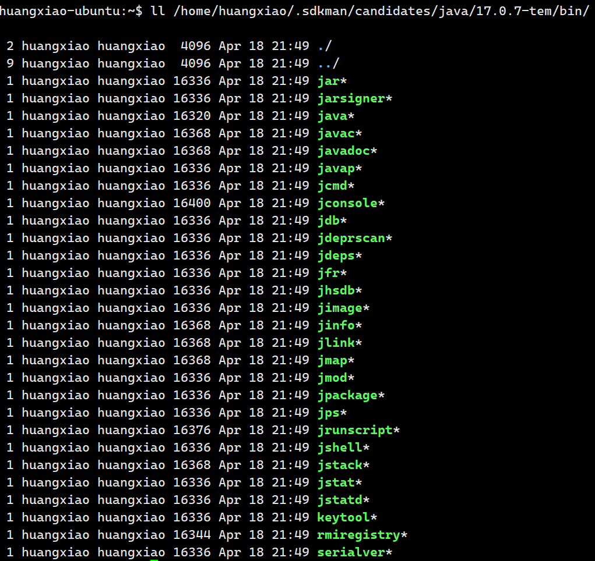
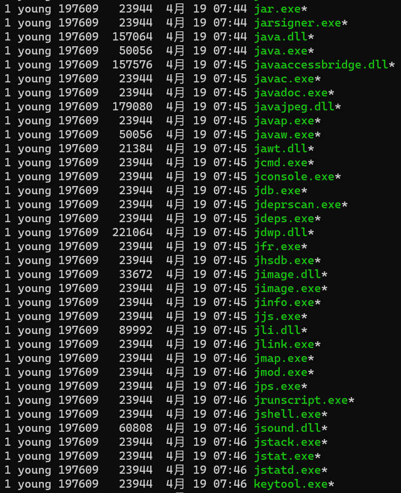
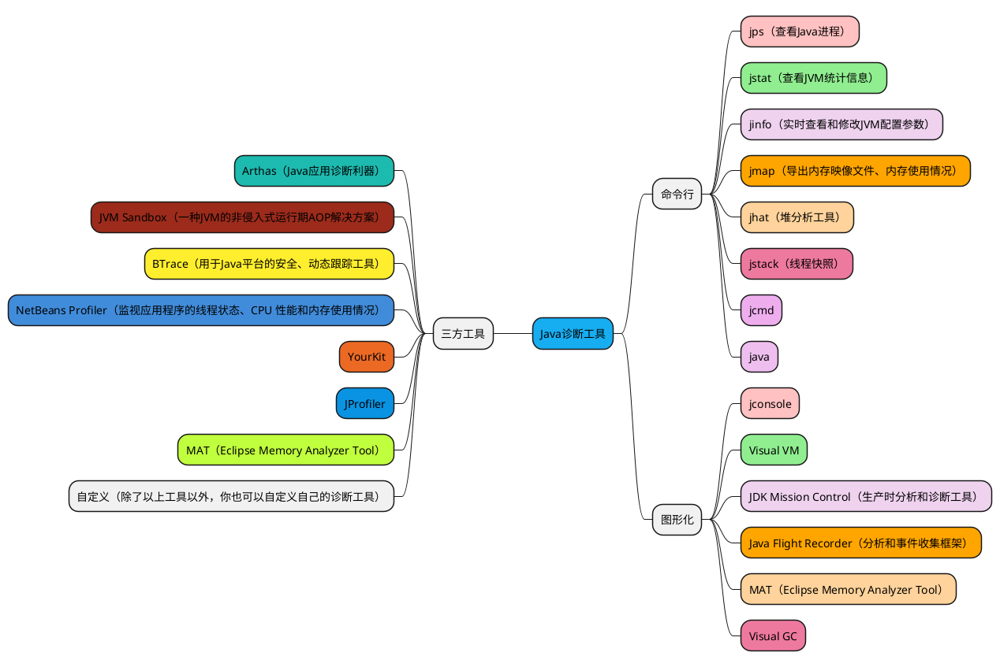

# 概述
> Java作为最流行的编程语言（之一），其应用性能诊断、监控一直受到业界广泛关注。
> 当然造成应用出现性能问题的因素非常多，例如线程控制、磁盘读写、数据库访问、网络I/O、垃圾回收等。
> 
> 要想定位这些问题，优秀的诊断工具必不可少。比如大家熟知的[Grafana](https://grafana.com/zh-cn/grafana/?tech=target&plcmt=footer-banner&aud=china#grafana-versions)、[prometheus](https://prometheus.io/)，不过这些工具可能更多的是从运维层面展示，而实际我们需要从开发层面去发现问题、分析问题、解决问题。
> 1. 无监控、不调优。
> 2. 使用数据说明问题、使用知识分析问题、使用工具处理问题。

在我们刚学习java的时候，大家最先接触的是`java`、`javac`这两个命令，实际上JDK还为我们添加了很多其它非常有用的工具，利用这些工具帮助开发人员很好的解决Java应用程序的一些疑难杂症。
- Mac系统下：

- Ubuntu系统下：

- Windows系统下：

## JDK Tool Specifications
> 需要注意的是每个JDK版本工具可能不太一样，就算不同版本都有相同的工具其可选参数也可能不一样，更不用说不同发行版的JDK更是如此，请参考：[Java Platform, Standard Edition Documentation](https://docs.oracle.com/en/java/javase/index.html)。

> 参考网络文章：https://learn.lianglianglee.com/%E4%B8%93%E6%A0%8F/JVM%20%E6%A0%B8%E5%BF%83%E6%8A%80%E6%9C%AF%2032%20%E8%AE%B2%EF%BC%88%E5%AE%8C%EF%BC%89