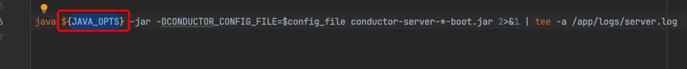
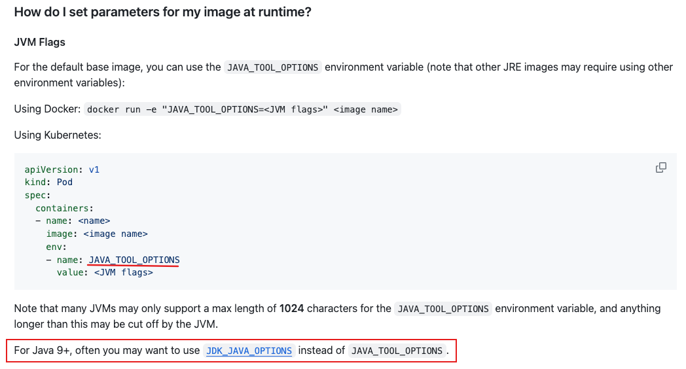

# 如何正确的设置JVM参数

随着服务容器化部署，特别是Docker、Kubernetes横行之下，如何正确的部署服务显得尤为重要，对于Java服务来说部署时设置JVM参数是个常见的事情。但大多数人并不清楚或并不了解在容器中如何正确的设置JVM参数，比如这样的：

这种方式思路肯定是可行的，但是里面有些坑， 此处不详细描述请看[passing-java-opts-to-spring-boot-application-through-docker-compose](https://stackoverflow.com/questions/53785577/passing-java-opts-to-spring-boot-application-through-docker-compose)。简单来说就是，Dockerfile注入的方式，在某些shell启动的场景会存在无法接收到“终止信号”（sigterm），谷歌列出了正确的做法：

Java 9之前用`JAVA_TOOL_OPTIONS`，之后用`JDK_JAVA_OPTIONS`。当然这也仅限Oracle官方的HotSpot VM，如IBM则叫IBM_JAVA_OPTIONS。
注意：至于JAVA_OPTS其实不是JVM所识别的参数，而是一些三方应用定义的，比如Tomcat。而`JAVA_TOOL_OPTIONS`是标准的，所有虚拟机都能识别和应用的。

##### 区别
- JDK_JAVA_OPTIONS：环境变量仅作用于java命令启用的程序（java -jar example.jar）。
- JAVA_TOOL_OPTIONS：环境变量除了对java命令生效，也对javac、jar等命令生效。

详细解释：[what-is-the-difference-between-jdk-java-options-and-java-tool-options-when-using](https://stackoverflow.com/questions/52986487/what-is-the-difference-between-jdk-java-options-and-java-tool-options-when-using)。