# 如何分发Java制品到Maven仓库

### 背景
昨天一组同学有个需求，统一设置各个项目的分发地址，避免侵入到每个项目中，因此就需要有个位置统一配置便于管控。但在实际实施过程中Maven输出以下错误：
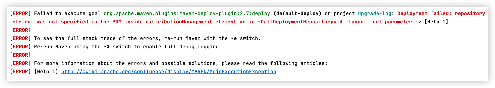
不过这里暂先不做问题的深究，先来分析下Java项目中如何分发一个制品到仓库中。

### 分析
我们开发的项目作为模块供其它项目使用，那么就需要部署到我们私服中。而如何部署就涉及到两处的配置：项目的pom.xml和Maven的settings.xml中配置。
- pom.xml
  ```xml
  <distributionManagement>
      <repository>
          <id>maven-releases</id>
          <name>Nexus</name>
          <url>https://nexus.mingyuanyun.com/repository/maven-releases/</url>
      </repository>
      <snapshotRepository>
           <id>maven-snapshot</id>
           <name>Nexus</name>
           <url>https://nexus.mingyuanyun.com/repository/maven-snapshots/</url>
     </snapshotRepository>
  </distributionManagement>
  ```
  这种方式适合单个项目，如果需要统一处理则不太合适，同时也会暴露分发地址。
- settings.xml
  ```xml
  <profile>
      <id>mingyuan-nexus</id>
      <!-- 部署仓库配置，需注意认证配置 -->
      <properties>
          <!-- 2.8版本开始配置方式 -->
          <altSnapshotDeploymentRepository>maven-snapshot::default::https://nexus.mingyuanyun.com/repository/maven-snapshots</altSnapshotDeploymentRepository>
          <altReleaseDeploymentRepository>maven-releases::default::https://nexus.mingyuanyun.com/repository/maven-releases</altReleaseDeploymentRepository>
  
          <!-- 2.8版本之前配置方式 -->
          <altDeploymentRepository>maven-snapshot::default::https://nexus.mingyuanyun.com/repository/maven-snapshots</altDeploymentRepository>
      </properties>
  </profile>
  ```
  这种方式则能很好的统一调控，但一般来说settings是独立于各个机器上，开发阶段不太方便。此方式就是上述问题中实施的，我们就以此方式来研究下到底该怎么做。

### 解决
上述同学采用的是settings.xml方式，同时从上述报错可知，使用的是org.apache.maven.plugins:maven-deploy-plugin:2.7:deploy，提示信息告知`-DaltDeploymentRepository=id::layout::url`没有指定。检查settings.xml配置，发现有如下配置：
```xml
<profile>
  <id>mingyuan-nexus</id>
  <properties>
    <altSnapshotDeploymentRepository>maven-snapshot::default::https://nexus.mingyuanyun.com/repository/maven-snapshots</altSnapshotDeploymentRepository>
    <altReleaseDeploymentRepository>maven-releases::default::https://nexus.mingyuanyun.com/repository/maven-releases</altReleaseDeploymentRepository>
  </properties>
</profile>
```
配置中没有“altDeploymentRepository”相关属性设置，却有“altSnapshotDeploymentRepository”和“altReleaseDeploymentRepository”的属性配置。问题分析到那只有一种可能就是上述配置与插件“org.apache.maven.plugins:maven-deploy-plugin:2.7”不匹配，上述配置应该是其它版本的。翻看该插件的2.7版本源码（maven-deploy-plugin/DeployMojo.java at maven-deploy-plugin-2.7 · apache/maven-deploy-plugin · GitHub），果然没有上述的读取逻辑，如下图：
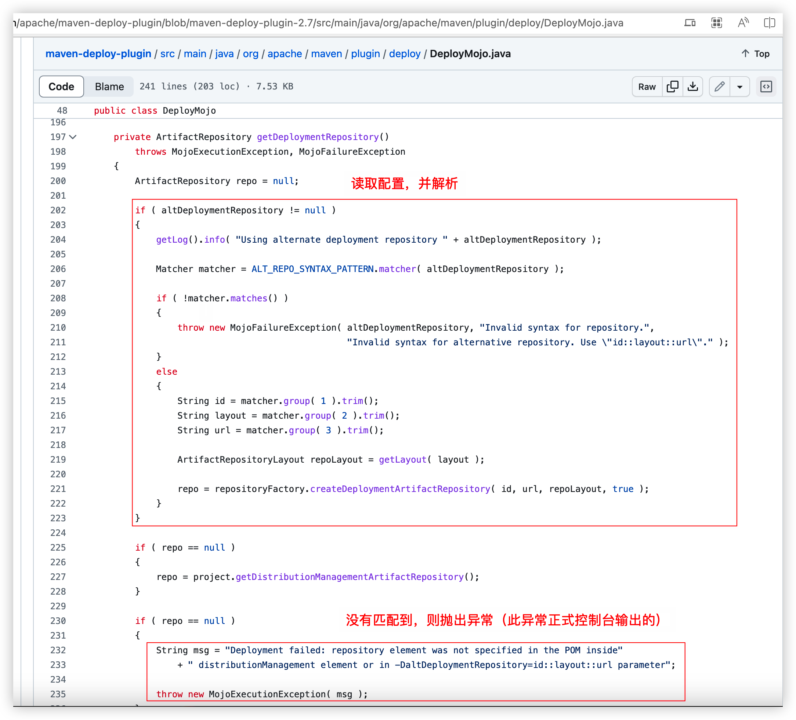
与此同时查看2.8版本的源码，如下图：
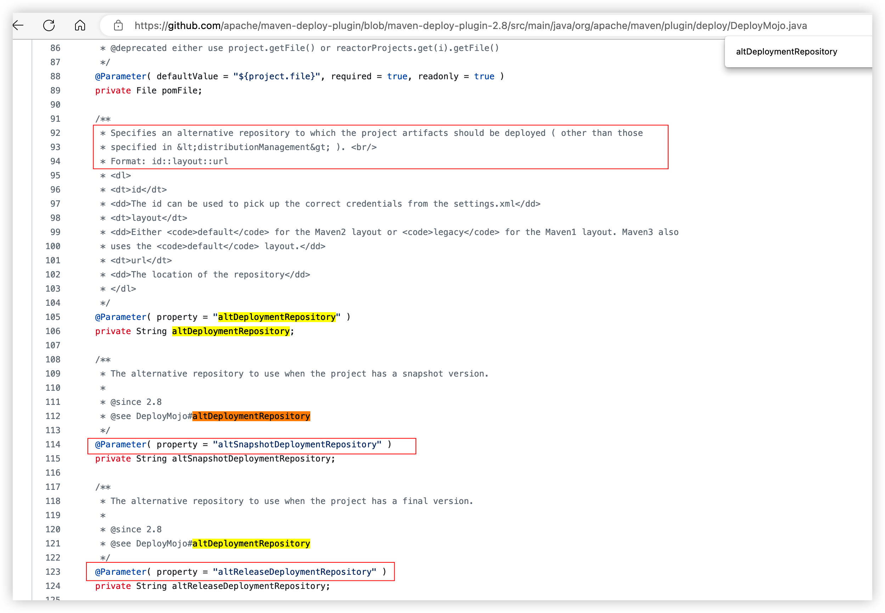
问题很明显了，需要把插件升级到2.8版本以上即可，而默认情况不设置版本则是2.7版本（至于为什么默认是2.7版本，则需要继续深入分析）。
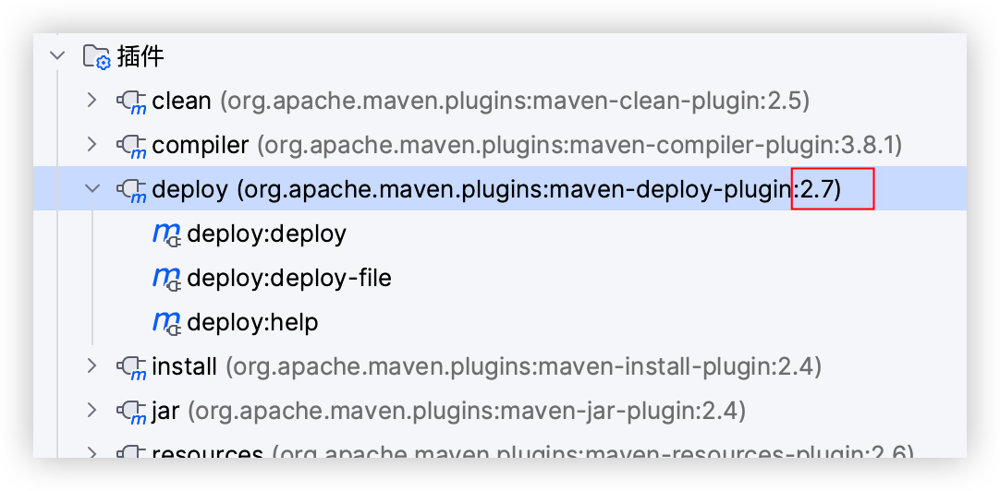
同时呢，也看了下2.7版本的配置方式，从配置上发现2.7版本的没有区分snapshot和release，没办法在一个profile下配置（分开配置应该是可以）。
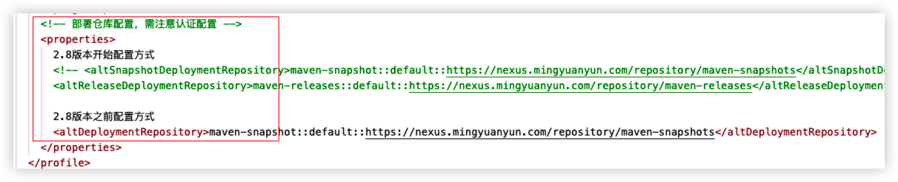

### 疑问？
问题分析到这里，其实已经把问题解决了，但依旧留下了个疑问，那就是这个插件的版本号到底是怎么来的？为什么没有任何配置的情形下却有这个版本，以及却有这么多插件呢？
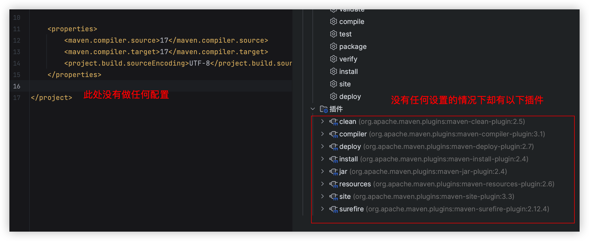
当手动配置插件并指定版本号
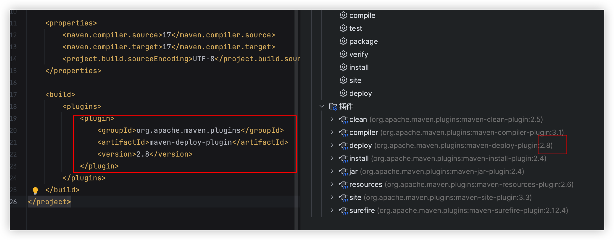
分析到这仅有一种可能，那就是存在maven默认行为（配置）） ！那到底在哪里呢？settings.xml还是 maven 工具本身呢？经过一系列的分析，最后决定下载与本机相应的maven版本源码一看究竟。
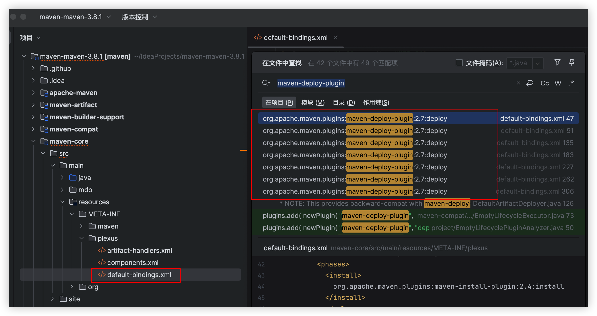
果不其然，在此目录下发现有个“default-bindings.xml”的配置，其版本号恰好是 2.7 版本，以及其它插件的配置都在此做了默认配置！为了验证上述的分析，修改此版本号为 2.8.2 并重新编译 Maven 源码：
```shell
mvn -DdistributionTargetDir="/Users/huangxiao/IdeaProjects/maven-maven-3.8.1/temp" clean package -s "/Users/huangxiao/.m2/settings_aliyun.xml" -Dmaven.test.skip=true  -Drat.skip=true
```
指定项目使用的Maven路径
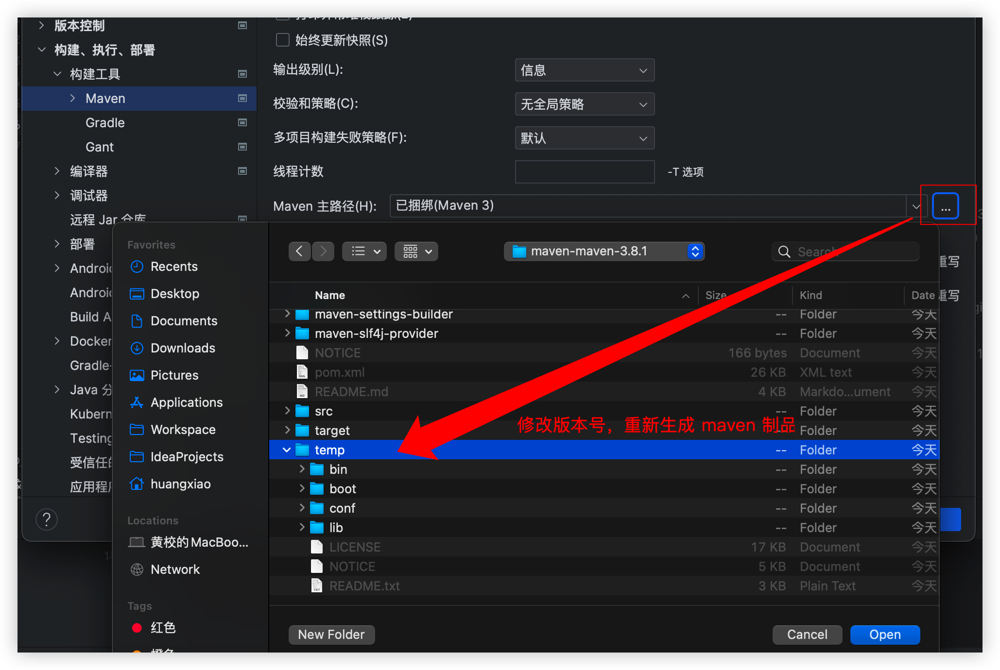
至此，问题分析完毕，此后在遇到类似问题就知道为啥了～

### 补充说明
另外还有个关于 SpringBoot插件的问题当初在用 Jenkins 构建时报以下错误：
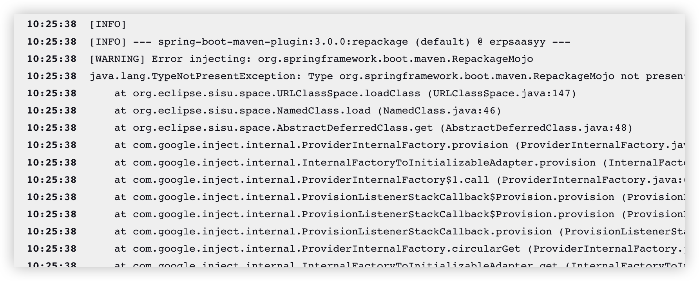
那一天恰巧 SpringBoot 发布了 3.0 版本，而随之依赖的插件版本也升级到 3.0 了，但我们的工程也没有显示设置版本号，当通过测试环境的 Jenkins 构建之后就默认使用了3.0版本。
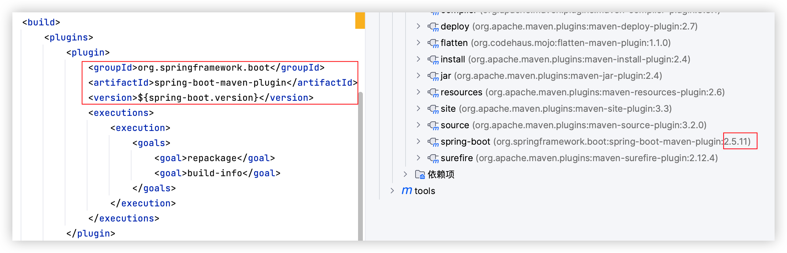
而 SpringBoot 默认是基于Java 17的，但我们的工程是基于 Java 11，从而报Java 语言级别错误：

解决办法就是根据工程实际使用的Spring Boot 版本设置插件版本。
