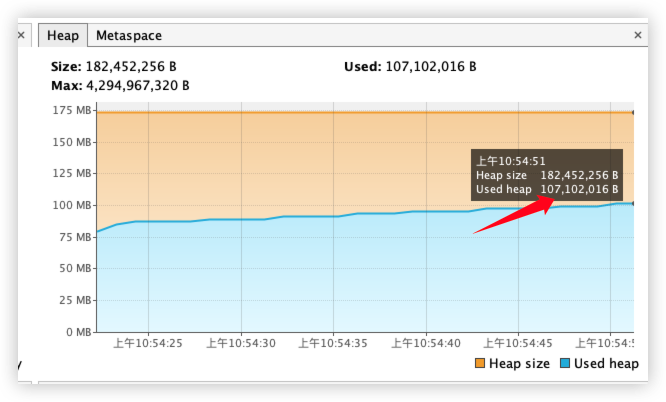

## 一、前置准备
### 1. 环境配置
- GraalVM 17
- macOS M1 16GB

### 2. JVM选项设置
默认值，不做任何的配置。

### 3. 测试准备
- 压缩包：4个安装包（包含platform-5.1.5.36.zip）
- 清空minio中的文件

## 二、诊断过程
### 1. 使用`Visual VM`观察CPU、内存、线程情况：
- 静止状态下，内存运行情况。
  1. GraalVM 17
  
  
  2. Eclipse JDK 11
  
  
  - 下图经历过线程池并行处理包（下载、解压、上传、路径适配）、调用租户接口获取租户、元数据、SQL等插件的逻辑。
    
    

#### 分析
可见，CPU的使用率很低，主要集中在内存和GC上。
- 内存：内存的消耗递增，且中间过程有多次GC。可以进一步分析哪处的内存占用最高。
- GC：可以明显看到“下载阶段”和“解压阶段”存在多次的GC。

### 2. 使用IDEA官方自带的`Profiler`
> 其实是IDEA整合了[async-profiler](https://github.com/async-profiler/async-profiler)。

#### 关联Java进程，生成`.jfr`文件

##### CPU

CPU消耗主要集中在下载安装包上面。
##### 内存

通过跟踪，发现解压时`FileUtils#copyToFile`方法内存分配很大。继续跟着发现缓冲区有`73.9MB`，而实际默认缓冲区才8KB，为何这么大？
  
  
  

可以看到“每次都new了新的buffer”，这就造成循环内生成大量的以8KB的数组对象，该对象只有等待方法结束之后才有可能被GC。

**备注**：关于`jfr`的分配为何这么大，参考此文章：[关于使用IDEA的profiler的内存分配的疑问 : IDEA-340722 (jetbrains.com)](https://youtrack.jetbrains.com/issue/IDEA-340722/IDEAprofiler)

## 三、优化方案
### 内存
1. 减少buffer的new的次数，只需要new一个即可；
2. 改造压缩流到文件的使用方式。

    
- 效果：
  - 优化前：[StartApplication_2023_12_12_204042-FileUtils#copyToFile.jfr](https://drive.weixin.qq.com/s?k=AIsAVQcAABIhUcQNyy)
  
  

  - 优化后：[StartApplication_2023_12_13_103851-IOUtils#copyLarge.jfr.zip](https://drive.weixin.qq.com/s?k=AIsAVQcAABIksyYgLC) 

  
    - 解压内存分配减少100MB
    
    

### GC
- 优化前
  - 解压阶段
  
    

- 优化后（只GC了一次）
  - 解压阶段
  
    

  - 下载阶段
  
    上述内存图中`下载阶段`有多次GC的情况，这是因为使用的是Java原生的`HttpURLConnection`，而使用minio的SDK自带的`okhttp`则没有此情况：
  
    