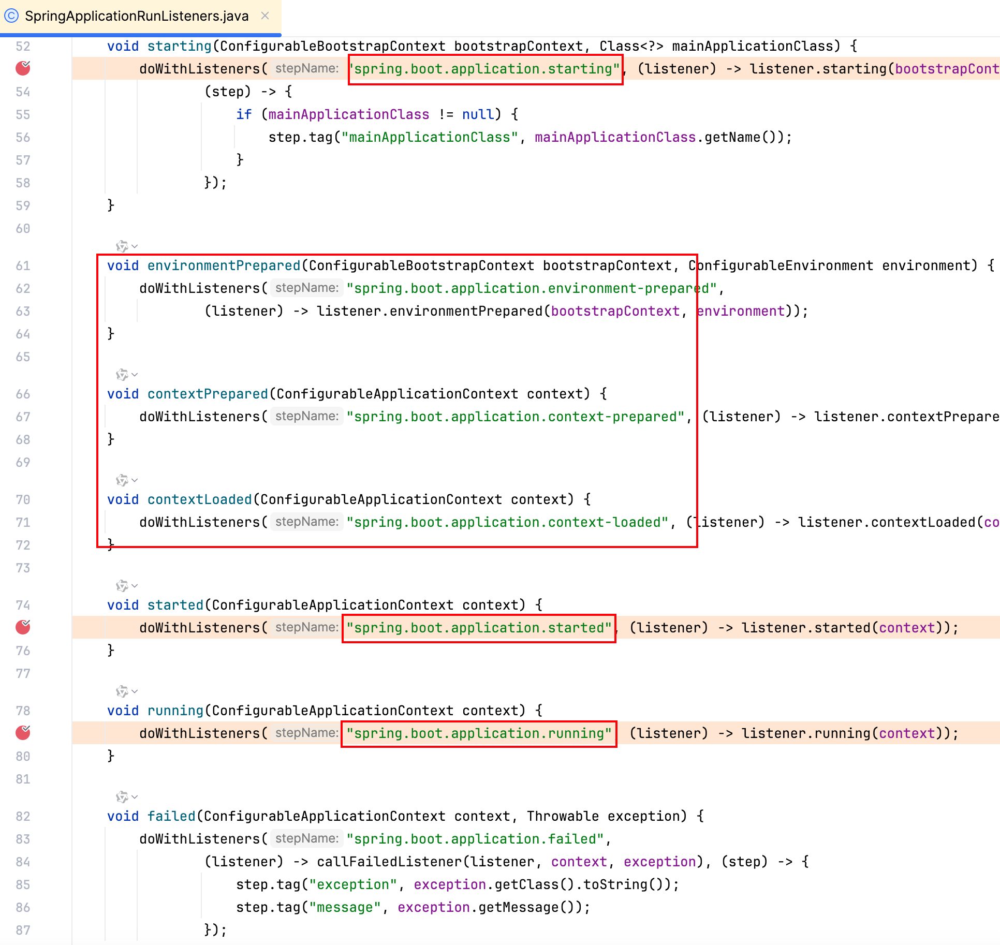

# 关于SpringBoot中3个探针的原理分析
我们都知道对于服务是否正常，可以通过探针来监测，它们分别是“启动探针”、“就绪探针”以及“存活探针”。关于它们的区别，详细可参考Kubernates的官方说明，这这里只探究Spring Boot是如何定义“存活”、“就绪”的？

先来看下SpringApplication的run方法，从这个方法可知，SpringBoot项目的启动分了很多的阶段，比如我们熟悉的“启动中”、“已启动”以及“运行中”，以及这三个阶段中穿插着环境准备，但它们都是由SpringApplicationRunListeners对象来驱动的。

进入到此类后发现SpringBoot把服务启动分了很多个步骤，每执行一个步骤只要没有出现异常（运行失败），则继续往下执行下一个步骤。下图中，中间的步骤就是在做环境相关的准备：

继续跟踪到doWithListeners方法，这里会遍历所有子类，比如我们自己实现的子类都会在这里执行。

但是需要注意的时，SpringApplication#run方法并非只会执行一次，因为SpringBoot有BootstrapContext、ApplicationContext，首先需要准备的是BootstrapContext的环境，其次是ApplicationContext。

方法内第一行代码就是在创建环境，由于是传统Web项目所以返回的是Servlet环境

当环境准备完毕后会再次构建SpringApplication对象并调用run方法，为了方便描述称此为子SpringApplication，最外层的为父SpringApplication。

当再次进入后执行prepareEnvironment方法内部，方法里面会做bootstrap相关的判断，则跳过bootstrap的后续逻辑

当上述的子SpringApplication结束后，再次回到父SpringApplication的prepareEnvironment方法，此处会再次判断是否有自定义环境。

上述的主要逻辑分析完毕后，再回到第一张图说的几个阶段。从源码可知，Spring把starting到started阶段视为启动中，即启动阶段；started到running（新版本为ready）则为就绪中，注意没有Startup状态。

但问题来了，在什么情况下才算“存活”，什么情况下才算“就绪”呢？答案就是WebServer启动好了就算“存活”，当执行完ApplicationRunner和CommandLineRunner之后就算“就绪了”，否则启动失败处理。

因此，对于部署在K8S的服务，如何配置启动探针的时长取决于你的服务何时能存活，当然如果严谨一点也可以放在存活或就绪之后。